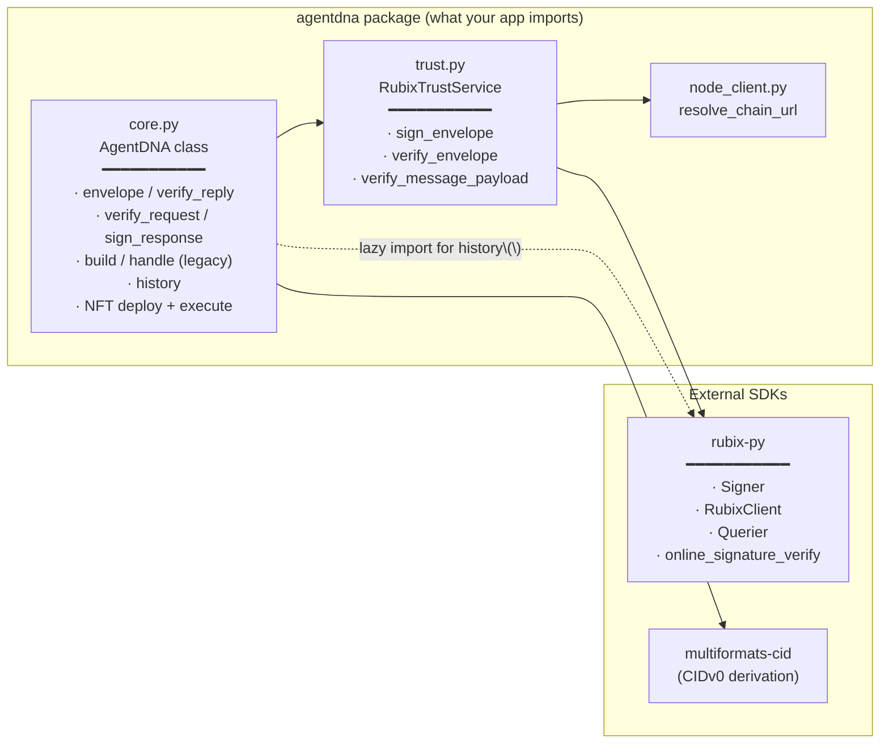
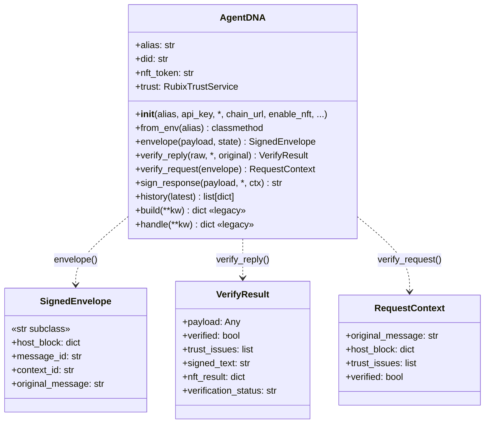

# AgentDNA — Architecture & Adoption Guide

A short reference for **how the `agentdna` package is structured internally** and **how adopters wire it into their applications**.

---

## 1. Package structure

```
agentdna/
├── __init__.py       — public exports
├── core.py           — AgentDNA class (everything an adopter touches)
├── trust.py          — RubixTrustService (rubix-py SDK adapter)
└── node_client.py    — resolve_chain_url() + back-compat NodeClient shim
```

### What lives where



The split is intentional:

| File | Role |
|---|---|
| **`core.py`** | What adopters use. Owns message envelope construction, NFT audit-log writes, and per-call state. |
| **`trust.py`** | The *only* place that talks to `rubix-py` for sign/verify. Swap-out point if Rubix changes. |
| **`node_client.py`** | URL resolution from config / env. Function + back-compat class. |

### Public exports

```python
from agentdna import (
    AgentDNA,         # the main class
    SignedEnvelope,   # str subclass returned by dna.envelope(...)
    VerifyResult,     # dataclass returned by dna.verify_reply(...)
    RequestContext,   # dataclass returned by dna.verify_request(...)
    RubixTrustService,# usually accessed via dna.trust
    NodeClient,       # back-compat shim
    resolve_chain_url,# preferred function form
)
```

### The `AgentDNA` surface



---

## 2. How an example adopts the package

Every example follows the **same two-sided pattern**: a **host** that initiates conversations and writes audit-log records, plus one or more **remotes** that verify and respond.

### Host side (the initiator)

```python
from agentdna import AgentDNA

dna = AgentDNA(alias="MyHostAgent", api_key=AGENTDNA_API_KEY)
# ↑ eagerly deploys this agent's audit-log NFT, tied to its DID

# 1. Sign an outbound request
env = dna.envelope({"user_query": "...", "tool": "...", "args": {...}})
# env is a str subclass — drop it straight into your transport

# 2. Send to remote (MCP, A2A, HTTP — agentdna doesn't care)
reply_text = await my_transport.send(str(env))

# 3. Verify the signed reply + write to chain
result = await dna.verify_reply(reply_text, original=env, remote_name="MyRemote")
# result.payload          — parsed reply body
# result.verified         — bool
# result.verification_status — "ok" | "failed" | "unknown"
# result.trust_issues     — list[str]
# result.nft_result       — chain receipt
```

### Remote side (the responder)

```python
from agentdna import AgentDNA

dna = AgentDNA(alias="MyRemote", api_key=AGENTDNA_API_KEY, enable_nft=False)
# ↑ pure responder — never writes to chain, no NFT deploy on construction

async def handle_call(args, dna_envelope=None):
    # 1. Verify the host's signed envelope
    ctx = await dna.verify_request(dna_envelope)
    if not ctx.verified:
        # decide how to respond — refuse, log, etc.
        ...

    # 2. Do the real work using ctx.original_message
    payload = run_my_business_logic(ctx.original_message, args)

    # 3. Sign the response back under the verified context
    return dna.sign_response(payload, ctx=ctx)
```

### End-to-end flow (sequence)


The **only** chain writes are: (a) one NFT deploy per agent at construction (for hosts), and (b) one NFT execute per `verify_reply()` call. Pure-remote agents do neither.

---

## 3. Adoption matrix — which example uses which pattern

| Example | Transport | Host | Remote(s) | Trust-layer footprint |
|---|---|---|---|---|
| `gemini_research_assistant` | in-process | Coordinator | 3 Researchers + 1 Synthesizer | `envelope` + `verify_reply` on coordinator; `verify_request` + `sign_response` on each remote (all `enable_nft=False`) |
| `google_sheets` | MCP stdio | Streamlit app | `server.py` (yfinance) | `envelope` + `verify_reply` on host; `verify_request` + `sign_response` per `@mcp.tool()` |
| `github` | MCP stdio | Streamlit app | `server.py` (GitHub API) | same pattern as google_sheets |
| `yahoo_finance` | MCP stdio | Streamlit app | `server.py` (yfinance) | same pattern as google_sheets |
| `multi_agent_system` | A2A | `host_agent_adk` (ADK) | Karley (ADK), Nate (CrewAI), Kaitlynn (LangGraph) | host: `envelope` + `verify_reply` over an A2A `MessageSendParams` payload; each remote: `verify_request` + `sign_response` in its `AgentExecutor.execute()` |
| `anthropic_managed_agents` | Anthropic Managed Agents API | (n/a — uses Anthropic's own session tracing instead of AgentDNA NFTs) | — | not applicable |
| `JIRA` | MCP stdio | Streamlit app | `server.py` (Jira REST) | still on the **legacy** `dna.build` / `dna.handle` API — migration pending |

### Files an example needs to wire AgentDNA in

| File | Purpose |
|---|---|
| `pyproject.toml` | declares `agent-dna = { path = "../../", editable = true }` so changes to the live source apply immediately |
| `.env` (+ `.env.sample`) | holds `AGENTDNA_API_KEY` (required) and any model/transport keys |
| `app.py` / host code | constructs `AgentDNA(alias=..., api_key=...)`, uses `dna.envelope` + `dna.verify_reply` |
| `server.py` / remote code | constructs `AgentDNA(alias=..., api_key=..., enable_nft=False)`, uses `dna.verify_request` + `dna.sign_response` |

### What the host-side audit-log NFT records

For each verified turn the host writes one record on chain. Decoded structure (rendered as a foldable tree by `dna.history()`):

```json
{
  "comment":  "Agent communication initiation to <remote_name>",
  "executor": "host_agent",
  "did":      "<host DID>",
  "verification": {
    "status":       "ok | failed",
    "trust_issues": [ ... ]
  },
  "host": { "agent": "<host DID>", "envelope": { ... }, "signature": "..." },
  "responses": [
    {
      "agent_did": "<remote DID>",
      "agent":     "<remote_name>",
      "envelope":  { "original_message": "...", "response": "...", "host_trust_issues": [...] },
      "signature": "..."
    }
  ]
}
```

This is the immutable record any audit / verification party can later check against the chain.

---

## 4. Lifecycle gotchas (saving future-you a debugging session)

| Symptom | Cause | Fix |
|---|---|---|
| `ModuleNotFoundError: No module named '<dep>'` from server | Spawned MCP subprocess used the wrong Python interpreter | Always launch via `uv run streamlit run app.py` from the example dir — `sys.executable` then resolves to `.venv/bin/python` |
| Library code edits don't take effect | `pyproject.toml` source is non-editable (`{ path = "../../" }` instead of `{ path = "../../", editable = true }`) | Add `editable = true`, then `uv sync` |
| `ValueError: Decoded key is not a uncompressed secp256k1 key` | Older `rubix-py 0.7.x` keystore in compressed format | `mv ~/.agentdna/account/<alias> ~/.agentdna/account/<alias>.compressed-bak`; next launch regenerates an uncompressed key (DID changes) |
| `500 Server Error` from `/rubix/v1/tx` on first deploy for one specific alias | Stuck account state on the Rubix node for that DID | Use a fresh alias (or quarantine the old keystore so a fresh DID is generated) |
| `API_KEY_INVALID` from Gemini | Stale / revoked / wrong-project Google AI Studio key | Regenerate at <https://aistudio.google.com/app/apikey>; the apps accept either `GEMINI_API_KEY` or `GOOGLE_API_KEY` |

---

## 5. Quick mental model

- **AgentDNA** is a thin trust layer on top of *any* agent transport. It knows nothing about MCP, A2A, HTTP — it just gives you signed strings to send and a typed result when you verify what you got back.
- **Trust split**: signing/verification happens locally via `rubix-py`. Audit-log writes (NFT execute) hit the Rubix chain. Adopters never call `rubix-py` directly — `agentdna.trust` is the only consumer.
- **Two-sided usage**: one agent's `dna.envelope(...)` is another agent's `dna.verify_request(...)`; one agent's `dna.sign_response(...)` is another agent's `dna.verify_reply(...)`. The four methods always go in those pairs.
- **One audit record per verified turn**, written by the host. Pure remotes never write to chain.
