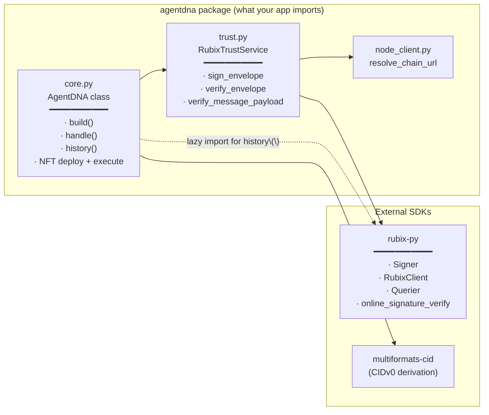
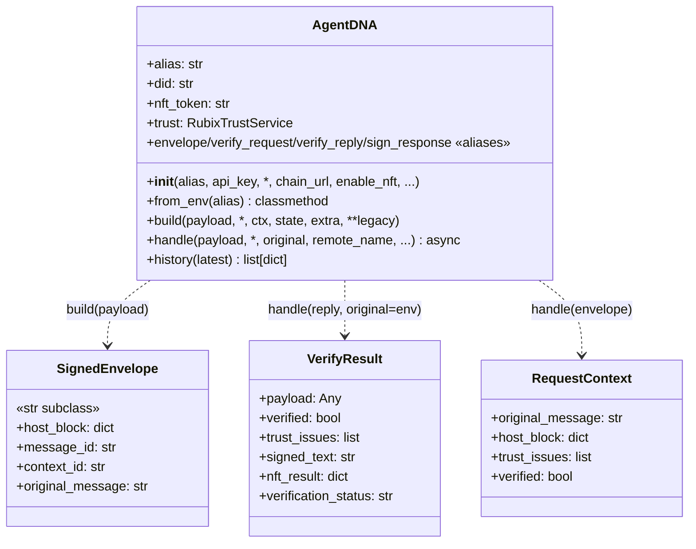
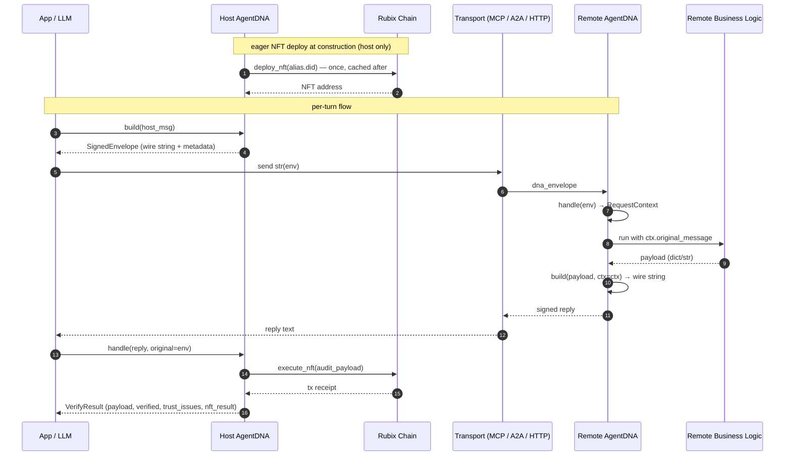

# AgentDNA Guide

**How the `agentdna` package is structured internally** and **How adopters wire it into their agentic systems**.

---

## 1. Package structure

```
agentdna/
├── __init__.py       — public exports
├── core.py           — AgentDNA class 
├── trust.py          — RubixTrustService (rubix-py SDK adapter)
└── node_client.py    — resolve_chain_url() + back-compat NodeClient shim
```

### What lives where




| File | Role |
|---|---|
| **`core.py`** | What adopters use. Owns message envelope construction, NFT audit-log writes, and per-call state. |
| **`trust.py`** | Links to `rubix-py` for sign/verify. |
| **`node_client.py`** | URL resolution from config / env. Function |

### Public exports

```python
from agentdna import (
    AgentDNA,         # the main class
    SignedEnvelope,   # str subclass returned by dna.build(payload)
    VerifyResult,     # dataclass returned by dna.handle(reply, original=env)
    RequestContext,   # dataclass returned by dna.handle(envelope)
    RubixTrustService,# usually accessed via dna.trust
    NodeClient,       # back-compat shim
    resolve_chain_url,# preferred function form
)
```

### The two public methods

**`dna.build(...)`** signs. **`dna.handle(...)`** verifies. Their behavior depends on what you pass:

| Call shape | Use it on | Returns |
|---|---|---|
| `dna.build(payload)` | Host signing a new request | `SignedEnvelope` (str + metadata) |
| `dna.build(payload, ctx=ctx)` | Remote signing a reply under a verified context | wire string |
| `await dna.handle(envelope)` | Remote verifying an inbound request | `RequestContext` |
| `await dna.handle(reply, original=env)` | Host verifying a signed reply (also writes the audit-log NFT) | `VerifyResult` |


### The `AgentDNA` surface



---

## 2. How to build an example

Every example follows the **same two-sided pattern**: a **host** that initiates conversations and writes audit-log records, plus one or more **remotes** that verify and respond.

### The Initiator (Host)

```python
from agentdna import AgentDNA

dna = AgentDNA(alias="MyHostAgent", api_key=AGENTDNA_API_KEY)
# ↑ creates DID and deploys agent's audit-log 'NFT'

# 1. Sign an outbound request
env = dna.build({"user_query": "...", "tool": "...", "args": {...}})
# env is a str subclass — drop it straight into your transport

# 2. Send to remote (MCP, A2A, HTTP — agentdna doesn't care)
reply_text = await my_transport.send(str(env))

# 3. Verify the signed reply + write to chain
result = await dna.handle(reply_text, original=env, remote_name="MyRemote")
# result.payload          — parsed reply body
# result.verified         — bool
# result.verification_status — "ok" | "failed" | "unknown"
# result.trust_issues     — list[str]
# result.nft_result       — chain receipt
```

### The responders (Remote)

```python
from agentdna import AgentDNA

dna = AgentDNA(alias="MyRemote", api_key=AGENTDNA_API_KEY, enable_nft=False)

async def handle_call(args, dna_envelope=None):
    # 1. Verify the host's signed envelope
    ctx = await dna.handle(dna_envelope)
    if not ctx.verified:
        # decide how to respond — refuse, log, etc.
        ...

    # 2. Do the real work using ctx.original_message
    payload = run_my_business_logic(ctx.original_message, args)

    # 3. Sign the response back under the verified context
    return dna.build(payload, ctx=ctx)
```

### End-to-end flow (sequence)




---

## 3. Adoption matrix — which example uses which pattern

| Example | Transport | Host | Remote(s) | Trust-layer footprint |
|---|---|---|---|---|
| `gemini_research_assistant` | in-process | Coordinator | 3 Researchers + 1 Synthesizer | host `build`/`handle` on coordinator; remote `handle`/`build(..., ctx=ctx)` on each researcher + synthesizer (all `enable_nft=False`) |
| `google_sheets` | MCP stdio | Streamlit app | `server.py` (Google Sheets API) | host `build`/`handle` on app side; remote `handle`/`build(..., ctx=ctx)` per `@mcp.tool()` |
| `github` | MCP stdio | Streamlit app | `server.py` (GitHub API) | same pattern as google_sheets |
| `yahoo_finance` | MCP stdio | Streamlit app | `server.py` (yfinance) | same pattern as google_sheets |
| `multi_agent_system` | A2A | `host_agent_adk` (ADK) | Karley (ADK), Nate (CrewAI), Kaitlynn (LangGraph) | host: `build`/`handle` over an A2A `MessageSendParams` payload; each remote: `handle`/`build(..., ctx=ctx)` in its `AgentExecutor.execute()` |
| `anthropic_managed_agents` | Anthropic Managed Agents API | (n/a — uses Anthropic's own session tracing instead of AgentDNA NFTs) | — | not applicable |
| `JIRA` | MCP stdio | Streamlit app | `server.py` (Jira REST) | still on the **kwarg-form** legacy `dna.build` / `dna.handle` API — same two methods, just the older call shape |

### Required Files for a new example

| File | Purpose |
|---|---|
| `pyproject.toml` | declares `agent-dna = { path = "../../", editable = true }` |
| `.env` (+ `.env.sample`) | holds `AGENTDNA_API_KEY` (required) and any model/transport keys |
| `app.py` / host code | constructs `AgentDNA(alias=..., api_key=...)`, uses `dna.build(payload)` + `await dna.handle(reply, original=env)` |
| `server.py` / remote code | constructs `AgentDNA(alias=..., api_key=..., enable_nft=False)`, uses `await dna.handle(envelope)` + `dna.build(payload, ctx=ctx)` |

### What is recorded on chain

For each verified turn the host writes one record on chain. Decoded structure (rendered as a foldable tree by `dna.history()`):

```json
{
  "comment":  "Agent communication initiation to <remote_name>",
  "executor": "host_agent",
  "did":      "<host DID>",
  "verification": {
    "status":       "ok | failed",
    "trust_issues": [ ... ]
  },
  "host": { "agent": "<host DID>", "envelope": { ... }, "signature": "..." },
  "responses": [
    {
      "agent_did": "<remote DID>",
      "agent":     "<remote_name>",
      "envelope":  { "original_message": "...", "response": "...", "host_trust_issues": [...] },
      "signature": "..."
    }
  ]
}
```

This is the immutable record any audit / verification party can later check from the chain.

---

## 4. Common Bugs and Fixes

| Symptom | Cause | Fix |
|---|---|---|
| `ModuleNotFoundError: No module named '<dep>'` from server | Spawned MCP subprocess used the wrong Python interpreter | Always launch via `uv run streamlit run app.py` from the example dir — `sys.executable` then resolves to `.venv/bin/python` |
| Library code edits don't take effect | `pyproject.toml` source is non-editable (`{ path = "../../" }` instead of `{ path = "../../", editable = true }`) | Add `editable = true`, then `uv sync` |
| `ValueError: Decoded key is not a uncompressed secp256k1 key` | Older `rubix-py 0.7.x` keystore in compressed format | `mv ~/.agentdna/account/<alias> ~/.agentdna/account/<alias>.compressed-bak`; next launch regenerates an uncompressed key (DID changes) |
| `500 Server Error` from `/rubix/v1/tx` on first deploy for one specific alias | Stuck account state on the Rubix node for that DID | Use a fresh alias (or quarantine the old keystore so a fresh DID is generated) |
| `API_KEY_INVALID` from Gemini | Stale / revoked / wrong-project Google AI Studio key | Regenerate at <https://aistudio.google.com/app/apikey>; the apps accept either `GEMINI_API_KEY` or `GOOGLE_API_KEY` |

---

## 5. A Quick 'What is AgentDNA'

- **AgentDNA** is a trust layer on top of *any* agentic system. It is framework agnostic (MCP, A2A, HTTP). It just gives you signed strings to send and a typed result when you verify what you got back.
