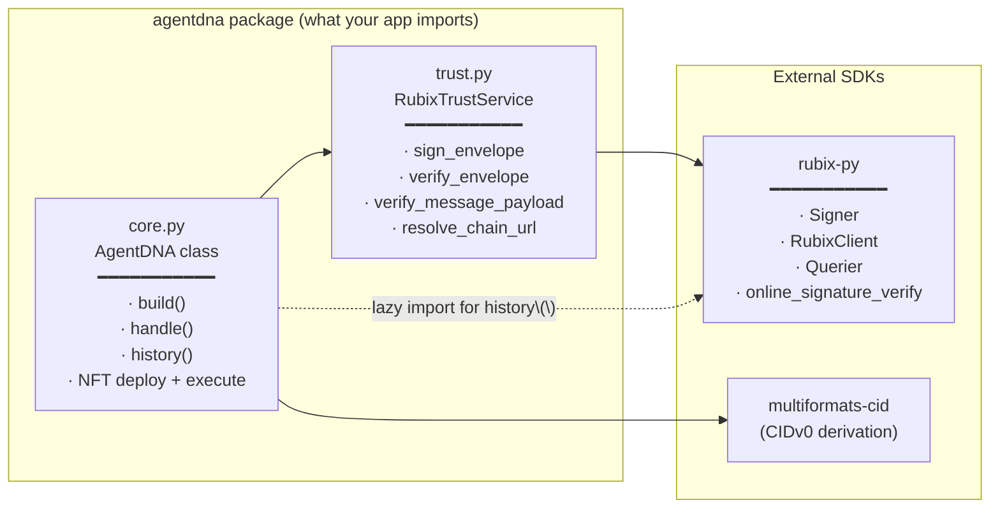
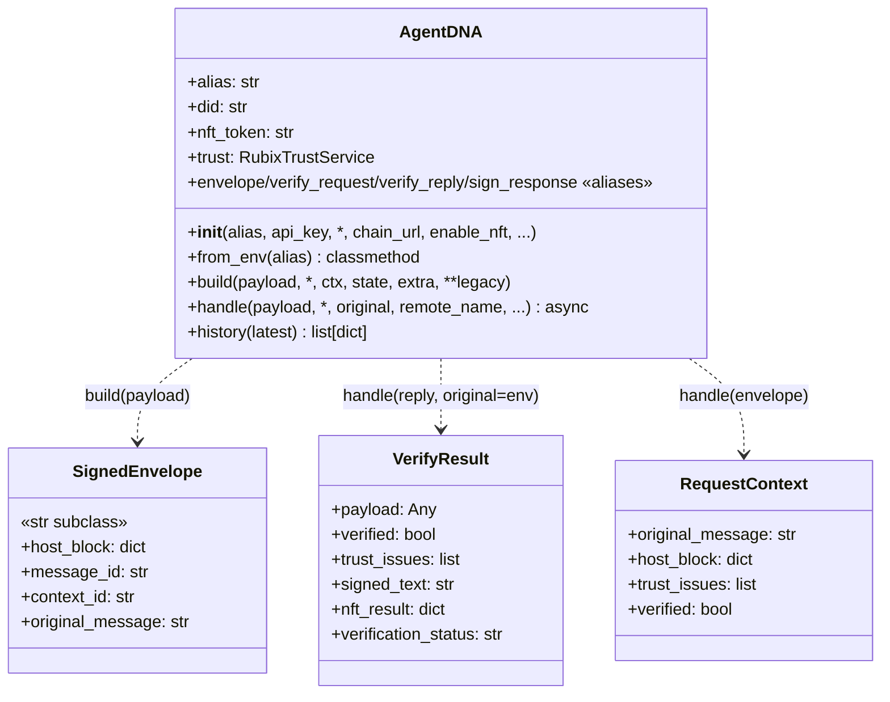
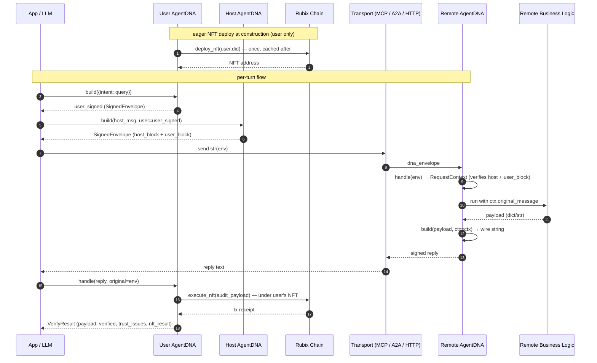

# AgentDNA Guide

**How the `agentdna` package is structured internally** and **How adopters wire it into their agentic systems**.

---

## 1. Package structure

```
agentdna/
├── __init__.py       — public exports
├── core.py           — AgentDNA class
└── trust.py          — RubixTrustService (rubix-py SDK adapter) + resolve_chain_url()
```

### What lives where




| File | Role |
|---|---|
| **`core.py`** | What adopters use. Owns message envelope construction, NFT audit-log writes, and per-call state. |
| **`trust.py`** | Links to `rubix-py` for sign/verify. Also hosts `resolve_chain_url()` (config / env URL lookup). |

### Public exports

```python
from agentdna import (
    AgentDNA,         # the main class
    SignedEnvelope,   # str subclass returned by dna.build(payload)
    VerifyResult,     # dataclass returned by dna.handle(reply, original=env)
    RequestContext,   # dataclass returned by dna.handle(envelope)
    RubixTrustService,# usually accessed via dna.trust
    resolve_chain_url,# Rubix node URL resolver
)
```

### The two public methods

**`dna.build(...)`** signs. **`dna.handle(...)`** verifies. Their behavior depends on what you pass:

| Call shape | Use it on | Returns |
|---|---|---|
| `dna.build(payload)` | User signing an intent / host signing a new request | `SignedEnvelope` (str + metadata) |
| `dna.build(payload, user=user_signed)` | Host signing over the user's signed intent (delegation chain) | `SignedEnvelope` |
| `dna.build(payload, ctx=ctx)` | Remote signing a reply under a verified context | wire string |
| `await dna.handle(envelope)` | Remote verifying an inbound request | `RequestContext` |
| `await dna.handle(reply, original=env)` | User (or host) verifying a signed reply (also writes the audit-log NFT) | `VerifyResult` |
| `dna.build(original_message=..., ...)` | Legacy (kwarg form) | `dict` |
| `await dna.handle(raw_text=...)` / `(resp_parts=...)` | Legacy (kwarg form) | `dict` |


### The `AgentDNA` surface



---

## 2. How to build an example

Every example follows the **same three-sided pattern**: a **user** at the top of the trust chain (owns the audit-log NFT), a **host** that signs over the user's intent and dispatches work, and one or more **remotes** that verify and respond.

### User side (top of the chain)

```python
from agentdna import AgentDNA
from datetime import datetime, timezone

# The user owns the audit-log NFT. Their alias gets its own DID + NFT.
user_dna = AgentDNA(alias=f"{HOST_NAME}_USER", api_key=AGENTDNA_API_KEY)

# 1. User signs their intent up front (once per request).
user_signed = user_dna.build({
    "intent": query,
    "ts": datetime.now(timezone.utc).isoformat(),
})
```

### Host side (the dispatcher)

```python
from agentdna import AgentDNA

# Pure signer — never writes to chain.
host_dna = AgentDNA(alias="MyHostAgent", api_key=AGENTDNA_API_KEY, enable_nft=False)

# 2. Sign an outbound request, embedding the user's signed intent.
env = host_dna.build(
    {"user_query": "...", "tool": "...", "args": {...}},
    user=user_signed,
)
# env carries both the host's signature and the user_block —
# the chain commits to "<user DID> delegated to <host DID>".

# 3. Send to remote (MCP, A2A, HTTP — agentdna doesn't care)
reply_text = await my_transport.send(str(env))

# 4. The *user* verifies the signed reply + writes the audit-log NFT.
result = await user_dna.handle(reply_text, original=env, remote_name="MyRemote")
# result.payload          — parsed reply body
# result.verified         — bool
# result.verification_status — "ok" | "failed" | "unknown"
# result.trust_issues     — list[str]
# result.nft_result       — chain receipt (under the user's NFT)
```

### The responders (Remote)

```python
from agentdna import AgentDNA

dna = AgentDNA(alias="MyRemote", api_key=AGENTDNA_API_KEY, enable_nft=False)

async def handle_call(args, dna_envelope=None):
    # 1. Verify the host's signed envelope (also verifies the embedded user_block).
    ctx = await dna.handle(dna_envelope)
    if not ctx.verified:
        # decide how to respond — refuse, log, etc.
        ...

    # 2. Do the real work using ctx.original_message
    payload = run_my_business_logic(ctx.original_message, args)

    # 3. Sign the response back under the verified context
    return dna.build(payload, ctx=ctx)
```

### End-to-end flow (sequence)



The **only** chain writes are: (a) one NFT deploy per user at construction, and (b) one NFT execute per user-side `dna.handle(reply, original=...)` call. Hosts and pure remotes never write to chain — they are signers only.

---

## 3. Adoption matrix — which example uses which pattern

| Example | Transport | User | Host | Remote(s) | Trust-layer footprint |
|---|---|---|---|---|---|
| `gemini_research_assistant` | in-process | sidebar alias (`{Coordinator}_USER`) | Coordinator | 3 Researchers + 1 Synthesizer | user signs intent; coordinator `build(..., user=user_signed)`; remotes `handle`/`build(..., ctx=ctx)`; user `handle` writes NFT |
| `google_sheets` | MCP stdio | sidebar alias (`GoogleSheetsAgent_USER`) | Streamlit app | `server.py` (Google Sheets API) | user signs intent; host `build(..., user=user_signed)`; user `handle` writes NFT |
| `github` | MCP stdio | sidebar alias (`{HOST_AGENT_NAME}_USER`) | Streamlit app | `server.py` (GitHub API) | same pattern as google_sheets |
| `yahoo_finance` | MCP stdio | sidebar alias (`{HOST_AGENT_NAME}_USER`) | Streamlit app | `server.py` (yfinance) | same pattern as google_sheets |
| `multi_agent_system` | A2A | sidebar alias (`host_USER`) | `host_agent_adk` (ADK) | Karley (ADK), Nate (CrewAI), Kaitlynn (LangGraph) | user signs intent per turn; host `send_message` builds with `user=` and user `handle` writes NFT |
| `anthropic_managed_agents` | Anthropic Managed Agents API | (n/a — uses Anthropic's own session tracing instead of AgentDNA NFTs) | — | — | not applicable |
| `JIRA` | MCP stdio | (still single-DID host) | Streamlit app | `server.py` (Jira REST) | still on the **kwarg-form** legacy `dna.build` / `dna.handle` API — same two methods, just the older call shape |

### Required Files for a new example

| File | Purpose |
|---|---|
| `pyproject.toml` | declares `agent-dna = { path = "../../", editable = true }` |
| `.env` (+ `.env.sample`) | holds `AGENTDNA_API_KEY` (required) and any model/transport keys |
| `app.py` / host code | constructs **two** `AgentDNA` instances: a per-user `user_dna = AgentDNA(alias=user_alias, api_key=...)` (eager NFT) and `host_dna = AgentDNA(alias=..., api_key=..., enable_nft=False)` (pure signer). Uses `user_dna.build(intent)` → `host_dna.build(payload, user=user_signed)` → `await user_dna.handle(reply, original=env)` |
| `server.py` / remote code | constructs `AgentDNA(alias=..., api_key=..., enable_nft=False)`, uses `await dna.handle(envelope)` + `dna.build(payload, ctx=ctx)` |

### What is recorded on chain

For each verified turn the user (not the host) writes one record on chain. Decoded structure (rendered as a foldable tree by `user_dna.history()`):

```json
{
  "comment":  "Agent communication initiation to <remote_name>",
  "executor": "user",
  "did":      "<user DID>",
  "verification": {
    "status":       "ok | failed",
    "trust_issues": [ ... ],
    "user_verified": true
  },
  "user": { "agent": "<user DID>", "envelope": { "intent": "...", "ts": "..." }, "signature": "..." },
  "host": { "agent": "<host DID>", "envelope": { ... }, "signature": "..." },
  "responses": [
    {
      "agent_did": "<remote DID>",
      "agent":     "<remote_name>",
      "envelope":  { "original_message": "...", "response": "...", "host_trust_issues": [...] },
      "signature": "..."
    }
  ]
}
```

This is the immutable record any audit / verification party can later check from the chain — and it cryptographically commits to the **user → host → remote** delegation chain.

---

## 4. Common Bugs and Fixes

| Symptom | Cause | Fix |
|---|---|---|
| `ModuleNotFoundError: No module named '<dep>'` from server | Spawned MCP subprocess used the wrong Python interpreter | Always launch via `uv run streamlit run app.py` from the example dir — `sys.executable` then resolves to `.venv/bin/python` |
| Library code edits don't take effect | `pyproject.toml` source is non-editable (`{ path = "../../" }` instead of `{ path = "../../", editable = true }`) | Add `editable = true`, then `uv sync` |
| `ValueError: Decoded key is not a uncompressed secp256k1 key` | Older `rubix-py 0.7.x` keystore in compressed format | `mv ~/.agentdna/account/<alias> ~/.agentdna/account/<alias>.compressed-bak`; next launch regenerates an uncompressed key (DID changes) |
| `500 Server Error` from `/rubix/v1/tx` on first deploy for one specific alias | Stuck account state on the Rubix node for that DID | Use a fresh alias (or quarantine the old keystore so a fresh DID is generated) |
| `API_KEY_INVALID` from Gemini | Stale / revoked / wrong-project Google AI Studio key | Regenerate at <https://aistudio.google.com/app/apikey>; the apps accept either `GEMINI_API_KEY` or `GOOGLE_API_KEY` |

---

## 5. A Quick 'What is AgentDNA'

- **AgentDNA** is a trust layer on top of *any* agentic system. It is framework agnostic (MCP, A2A, HTTP). It just gives you signed strings to send and a typed result when you verify what you got back.
- **Trust split**: signing/verification happens locally via `rubix-py`. Audit-log writes (NFT execute) hit the Rubix chain. Adopters never call `rubix-py` directly — `agentdna.trust` is the only consumer.
- **Three-sided delegation chain**: the **user** signs intent (top of chain, owns the NFT), the **host** signs over the user's signed block (`build(payload, user=user_signed)`), the **remote** verifies both and signs the reply (`build(reply, ctx=ctx)`). The user verifies and writes the audit log.
- **Two methods, four call shapes**: `dna.build(payload)` signs a request, `dna.build(payload, ctx=ctx)` signs a reply, `await dna.handle(envelope)` verifies a request, `await dna.handle(reply, original=env)` verifies a reply.
- **One audit record per verified turn**, written by the **user** (not the host). Hosts and pure remotes never write to chain.
